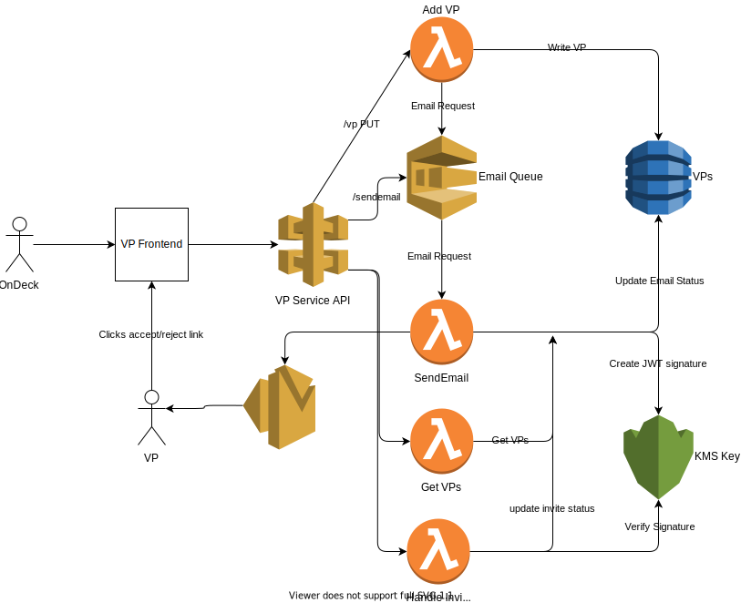

# VP Service

## Overview

This service handles input of VP data, sending them an invite, and updating status depending on acceptance/rejection of the invite.

For local development, see [DEV.md](./DEV.md)

## Architecture

The system consists of the following:

1. Frontend where a recruiter/coordinator can enter the information of a VP, see their invite status, and resend the invite email if the VP did not receive it
2. An API which handles all the business logic of these processes, including storing VP data, sending them and email, and handling accept/reject of the invitation

## System Flow

1. An OnDeck employee adds a VP in the website, providing a name and email.
2. This triggers the API call to add the VP to the database, and puts a message in the email queue to send an email to the VP
3. The send email lambda is triggered by the message and sends the email, along with update the sentEmail status for the VP
4. The VP receives the email invite, which contains an accept/reject link. These are URLS with an JWT token that is configured with an encrypted signature to prevent tampering. In additon, the links have an expiration date.
5. The VP clicks on either the accept/reject link - which takes them to the frontend and triggers the API call to handle their acception/rejection of the invite.
6. If the VP does not receive the email, or the links expire before they are able to get to the email - the OnDeck employee can click Resend Email in the website to send a new invite to the VP.

## Design Choices

### Serverless

I decided to make the API a series of small lambdas fronted by an API GW, and used Serverless framework to orchestrate this. The reasoning is each required task for this system is very small and each is overall a light computational load, so splitting into into small lambdas that represent each major feature made sense.

From this perspective, it worked overall. In addition, this architecture can scale essentially as much as AWS will let it scale rather than being held back by specific resources requirements if something like ECS was decided

In addition, using an API GW gives us a lot of flexbility for control of use. We could implement OAuth via an authorizer, and also use API Keys to track usage. Additionally, we could set up rate limiting to prevent our lamdbas from being overloaded.

#### Challenges

Most challenges I faced with serverless was the "framework" itself, specifically having a consistent development environment. The quality/maintenance of various plugins to assist with local development was vastly varied. Some plugins, like `serverless-offline` are well maintained and easy to use, which others just did not work and actually caused the whole development environment to break.

I would likely migrate away from using plugins for running anything besides the apigw & lambdas locally and migrate to [`localstack`](https://localstack.cloud/) for a more reliable experience. Also, systems like KMS aren't locally "runnable" so having some kind of dev key for testing is required.

In addition, this is the first time I actually used the Serverless framework tool, so there was some learning curves.

### Typescript Backend

I decided on using Typescript for writing the lambdas. The reason I went for Typescript over pure Javascript was for readability mostly. If other engineers needed to work on this, the types would help make it more clear what is going on. In addition, I can do some light OOP to make working on this safer and easier.

I mostly made classes for each of the "major" functionalities (interacting with various AWS services, JWT work) so make the code readable and in addition make it more testable. The handlers are mostly just promise chains consuming these classes.

### SQS

I made the choice to use SQS to trigger the lambda that send the email to the VP. My reason for this is email is something that can happen async, and I dont want actions like adding a VP to the data store to be blocked by sending an email, especially when sending an email is reliant on a third-party system.

Having email be an async action allows us to handle a large influx of VPs being added without bogging the system down, and allows us to scale as more traffic comes.

#### Challenges

The main challenge when creating a system that perform works async is ensuring you are properly alerted when something goes wrong and failures are handled in such a way that they dont take down the system and there are ways to remediate the situation.

In a more "production-ready" implementation of this, I would likely implement a dead letter queue which would store messages that failed to process. We could have a job to rerun these. In addition, I would create some kind of alerting around this so we are notified and it can be investigated

### KMS

KMS is used to encrypt the signature for a JWT token. The JWT token is used to encode the details of a VPs invitation (whether they accept/reject). I decided to make it a JWT token so I could encode their data in a URL, which would later be used to trigger the status update event. I wanted to make sure the invitation URL was tamper-proof, which lead me to using KMS to sign and verify the JWT. In addition, I implemented an expiration time on the URLs so they could not be abused by someone else who managed to get the URL in the future.

### SES

I used SES (Simple Email Service) to send an email to the VP. This is mostly because I am already in the AWS ecosystem, so it was the easiest to use.

#### Challenges

One challenge I faced is when you are in "sandbox" mode with SES, you have to validate each email address you wish to send an email to. In a production environment, you would upgrade your SES account to production so this limitation is removed.

I also found that I often did not receive the email the first time and had to have it resent. I'm unsure if this is SES's issue, or something Gmail is doing.

### DynamoDB

I chose to use a NoSQL database for this. The reason is because we are storing a small amount of data, and we don't need the overhead of relational data, a DB engine, etc. In addition, this makes it easy for us to add new fields to the record if we need to store more metadata on the VP. DynamoDB is also managed by AWS and is very scaleable.

### React

I decided to use React to create the UI. UI is a skillset I am not particuarly good with, and my past attempts to use Angular mostly left me frustrated. I found React easier to pick up and use. I tried to keep the UI as simple as possible due to my lack of UI skills.

In a "production" environment, I would likely work with someone more knowledgable in UI work to improve the look/feel.

notes:

NODE_ENV=test for local sqs

TODO:
Features:
  1. Add Add VP to UI
  2. Add resend email button
  3. Add route for reading jwt token and calling downstream lambda

Cleanup:
  1. Implement real env vars setup
  2. Move clients up so I can use DI
  3. Write Unit Tests
  4. Write Docs

